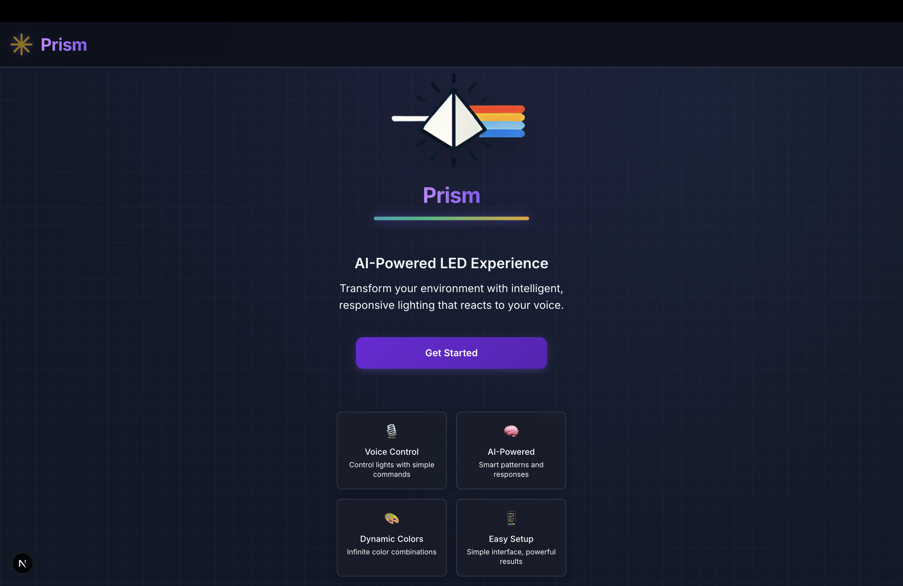
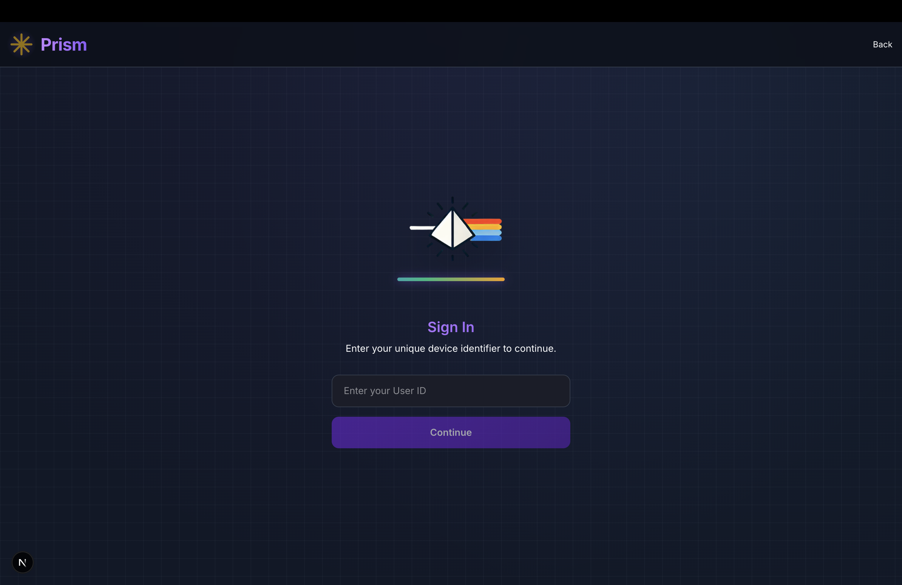
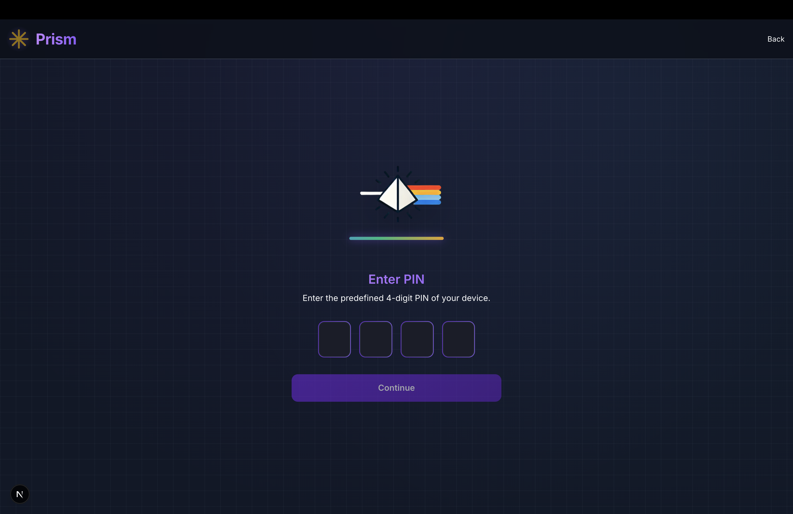
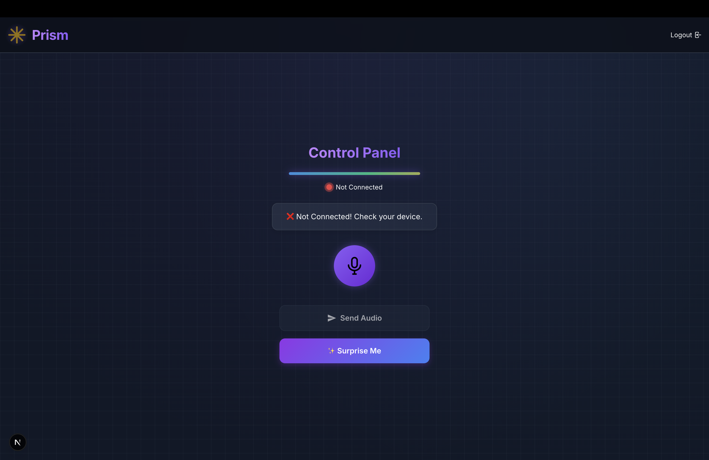
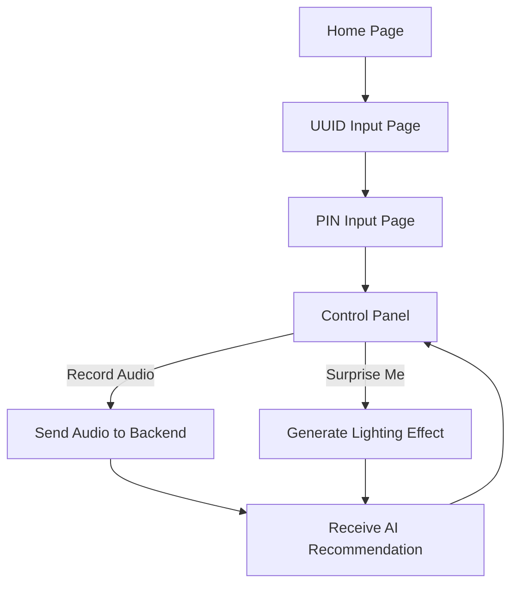
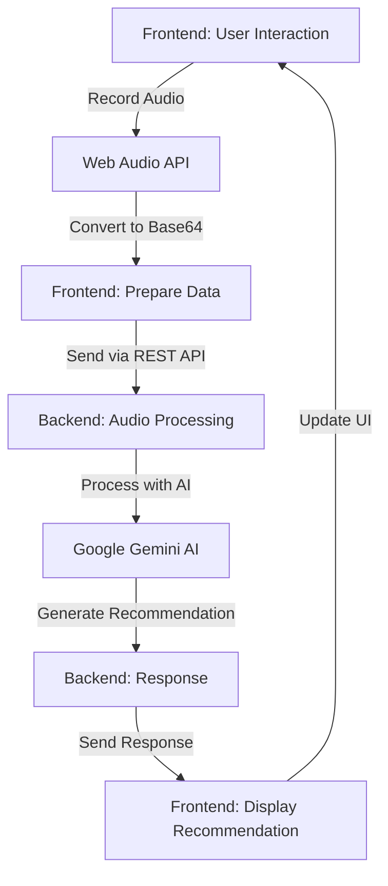

# AI LED Frontend

This repository contains the frontend application for an AI-powered LED control system. The application provides a user interface for controlling LED strips through voice commands processed by Google's Gemini AI. The frontend is built with Next.js and communicates with the backend through REST APIs and WebSockets.

## Project Repositories

- **Frontend**: [AI_LED_Frontend](https://github.com/TaemnLee/AI_LED_Frontend) (this repository)
- **Backend**: [AI_LED_Backend](https://github.com/sunhome243/AI_LED_Backend)
- **Project Canvas**: [Lean Canvas](https://sunhome243.github.io/leancanvas/) - Learn more about the project vision, target customers, and business model

## Application Overview

This application allows users to interact with their LED devices using a unique UUID and PIN. Below are some screenshots showcasing the application's features:

### 1. Home Page


### 2. UUID Input Page


### 3. PIN Input Page


### 4. Recording Page


The AI LED Frontend provides a modern, intuitive interface for users to:

1. **Connect to LED devices** with UUID and PIN authentication
2. **Record voice commands** that are sent to the backend for AI processing
3. **Receive lighting recommendations** based on emotional analysis of voice input
4. **Generate surprise lighting effects** without voice input
5. **Monitor connection status** between the application and LED device

## Features

### Voice Command Processing

Users can record voice commands that are sent to the backend, where Google Gemini AI analyzes the emotional content and context to generate appropriate lighting recommendations.

### Surprise Me Function

The "Surprise Me" feature generates lighting effects without requiring voice input, based on user history and AI-generated patterns.

### Real-time Connection Monitoring

The application monitors WebSocket connections to LED devices in real-time, providing visual feedback about connection status.

### AI Recommendations Display

Lighting recommendations from the AI are displayed in a user-friendly format, explaining the emotional context and lighting choice.

## Technology Stack

- **Next.js**: React framework for building the application
- **TailwindCSS**: Utility-first CSS framework for styling
- **WebSocket API**: For real-time communication with backend
- **Web Audio API**: For voice recording and processing

## User Flow

1. **Home Page**: Introduction to the application and "Get Started" button
2. **UUID Page**: Enter unique device identifier
3. **PIN Page**: Enter 4-digit PIN for authentication
4. **Control Panel**: Main interface for recording voice commands and receiving AI recommendations

### User Flow Diagram



## API Integration

The frontend communicates with the backend through several endpoints:

### REST API Endpoints

- **Connection Status Check**: `POST /is_connect`
- **Audio Processing**: `POST /audio_to_ai/create`
- **Pattern Generation**: `POST /pattern_to_ai/create`

### Data Flow

1. **Audio Recording**: Captured using Web Audio API
2. **Format Conversion**: Audio converted to base64 for transmission
3. **API Submission**: Audio sent to backend for processing
4. **Response Handling**: AI recommendations displayed to user

### Data Flow Diagram



## UI/UX Design Elements

The application features a modern, dark-themed UI with:

- **Gradient accents**: Purple and indigo gradients throughout the interface
- **Glassmorphism**: Blurred, translucent backgrounds for cards and panels
- **Animations**: Subtle animations for transitions and interactive elements
- **Responsive design**: Optimized for both desktop and mobile devices

## Component Structure

The application is organized into the following pages:

- **index.js**: Home/landing page with feature overview
- **uuid.js**: UUID entry page for device identification
- **pin.js**: PIN entry page for authentication
- **recording.js**: Main control panel for voice commands and visualization

### Key Components

- **Record Button**: For capturing voice commands
- **Audio Visualizer**: Visual feedback during recording
- **Connection Indicator**: Shows real-time device connection status
- **System Message**: Provides feedback on application state
- **AI Recommendation Card**: Displays AI responses and lighting suggestions

## Prerequisites

- Node.js 14+ and npm/yarn
- Modern web browser with WebSocket and Web Audio API support

## Setup Instructions

1. Clone the repository:

```bash
git clone https://github.com/TaemnLee/AI_LED_Frontend.git
cd AI_LED_Frontend
```

2. Install dependencies:

```bash
npm install
# or
yarn install
```

3. Create `.env.local` file with API endpoints:

```
NEXT_PUBLIC_API_URL=https://your-api-gateway-id.execute-api.region.amazonaws.com/dev
NEXT_PUBLIC_WEBSOCKET_URL=wss://your-api-gateway-id.execute-api.region.amazonaws.com/develop
```

4. Run the development server:

```bash
npm run dev
# or
yarn dev
```

5. Open [http://localhost:3000](http://localhost:3000) in your browser

## Building for Production

```bash
npm run build
# or
yarn build
```

Then, deploy the contents of the `out` directory to your hosting provider.

## Responsive Design

The application is fully responsive and optimized for:

- Desktop computers
- Tablets
- Mobile phones

## Accessibility Features

- Semantic HTML structure
- ARIA attributes for screen readers
- Keyboard navigation support
- Sufficient color contrast for readability

## Browser Compatibility

- Chrome (latest)
- Firefox (latest)
- Safari (latest)
- Edge (latest)

## Project Structure

```
/public
  /logomark.svg       # Logo icon
  /prisimLogo.png     # Full logo image
  /...                # Other static assets

/src
  /pages              # Next.js pages
    /_app.js          # App component wrapper
    /index.js         # Home/landing page
    /uuid.js          # UUID entry page
    /pin.js           # PIN entry page
    /recording.js     # Main control interface

  /styles
    /globals.css      # Global styles and TailwindCSS
```

## Future Improvements

1. **User Accounts**: Implement user accounts for personalized experiences
2. **History View**: Add a history of previous voice commands and lighting patterns
3. **Favorite Presets**: Allow users to save favorite lighting configurations
4. **Advanced Scheduling**: Set schedules for automatic lighting changes
5. **Multi-device Support**: Control multiple LED devices from a single interface

## Contact

For more information or assistance, please contact:

- Email: [lee_t1@denison.edu](mailto:lee_t1@denison.edu)
- Project Canvas: [https://sunhome243.github.io/leancanvas/](https://sunhome243.github.io/leancanvas/)
